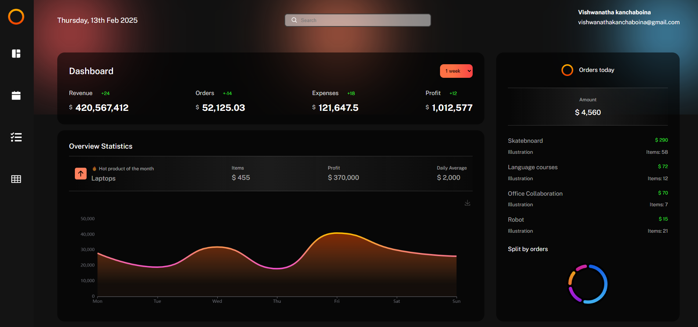
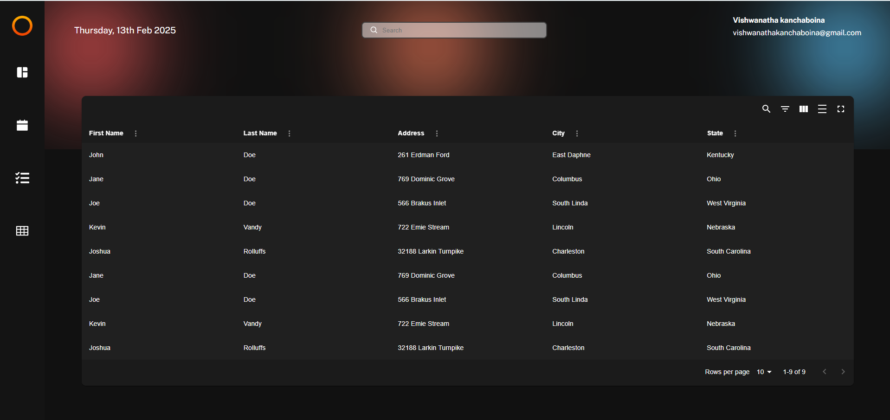
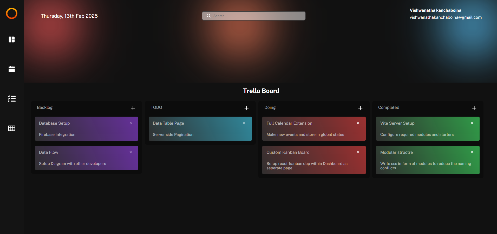

---

# **Admin Dashboard v2**

🚀 **Admin Dashboard v2** is a modern, responsive admin panel built with **React** and **Vite**. It provides an interactive and efficient way to manage and visualize data.

## **Features**
✅ Modern UI/UX  
✅ Built with React and Vite for fast performance  
✅ Responsive design for mobile and desktop  
✅ Component-based structure  
✅ Easy customization  

---

## **Tech Stack**
- **Frontend:** React, Vite, HTML, CSS, JavaScript
- **Build Tool:** Vite
- **Package Manager:** Yarn (recommended) or npm

---

## **Getting Started**

### **Prerequisites**
Before you begin, make sure you have the following installed:
- **Node.js** (v16+ recommended)
- **Yarn** (or npm)

### **Installation**
1. **Clone the repository**
   ```sh
   git clone <url>
   ```
2. **Navigate into the project directory**
   ```sh
   cd admin_dashboard_v_2
   ```
3. **Install dependencies**
   ```sh
   yarn install
   ```
   _(or with npm)_
   ```sh
   npm install
   ```

---

## **Running the Project**
To start the development server:
```sh
yarn dev
```
_(or with npm)_
```sh
npm run dev
```
After running the command, open your browser and go to:  
➡️ `http://localhost:5173/`

---

## **Building for Production**
To create an optimized production build, run:
```sh
yarn build
```
_(or with npm)_
```sh
npm run build
```
The build output will be in the `dist/` directory.

To preview the production build:
```sh
yarn preview
```
_(or with npm)_
```sh
npm run preview
```

---

## **Folder Structure**
```
admin_dashboard_v_2/
│── assets/          # Static assets (images, fonts, etc.)
│── public/          # Public files
│── src/             # Main source code
│   ├── components/  # Reusable components
│   ├── pages/       # Page components
│   ├── styles/      # CSS stylesheets
│   ├── App.js       # Main app component
│   ├── main.js      # Entry point
│── index.html       # Main HTML file
│── package.json     # Project metadata and dependencies
│── vite.config.js   # Vite configuration file
│── yarn.lock        # Dependency lock file
```

---

## **Troubleshooting**
- **Port Conflict:** If port `5173` is already in use, run:
  ```sh
  yarn dev --port 3000
  ```
- **Dependency Issues:** If installation fails, try:
  ```sh
  rm -rf node_modules yarn.lock package-lock.json
  yarn install
  ```
- **Vite Not Found:** If you get a Vite-related error, install it globally:
  ```sh
  yarn global add vite
  ```

---

## **Contributing**
Contributions are welcome! To contribute:
1. Fork the repository.
2. Create a new branch:  
   ```sh
   git checkout -b feature-name
   ```
3. Make your changes and commit:  
   ```sh
   git commit -m "Added new feature"
   ```
4. Push to your fork and submit a pull request.

---

## **License**
💻 **Admin Dashboard v2** is an open-source project built to provide a modern and efficient admin panel.

---

Let me know if you need any modifications! 🚀

### Dashboard Page
<a href="#"></a>
### Calendar Page
<a href="#"></a>
### Kanban Board Page
<a href="#"></a>
### DataGrid Page
<a href="#"></a>
